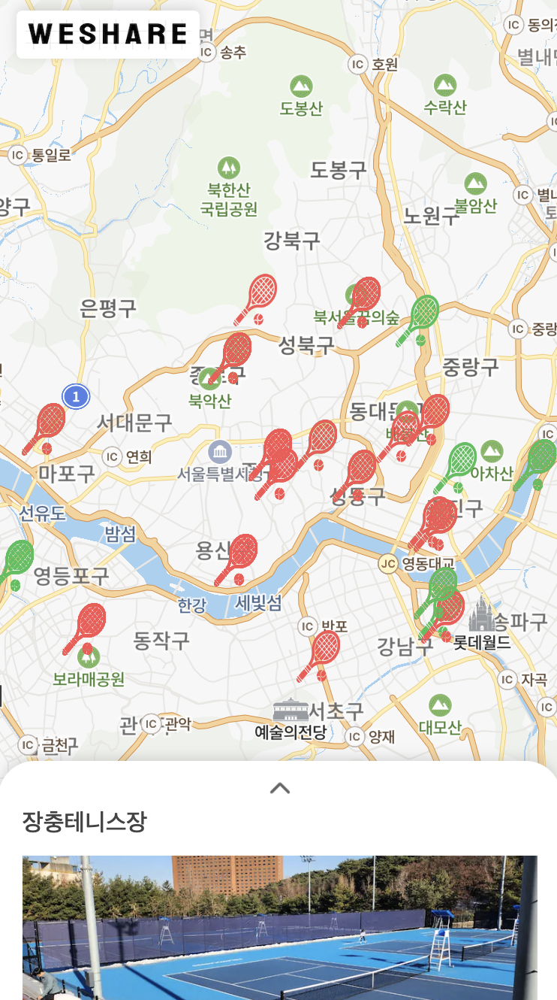
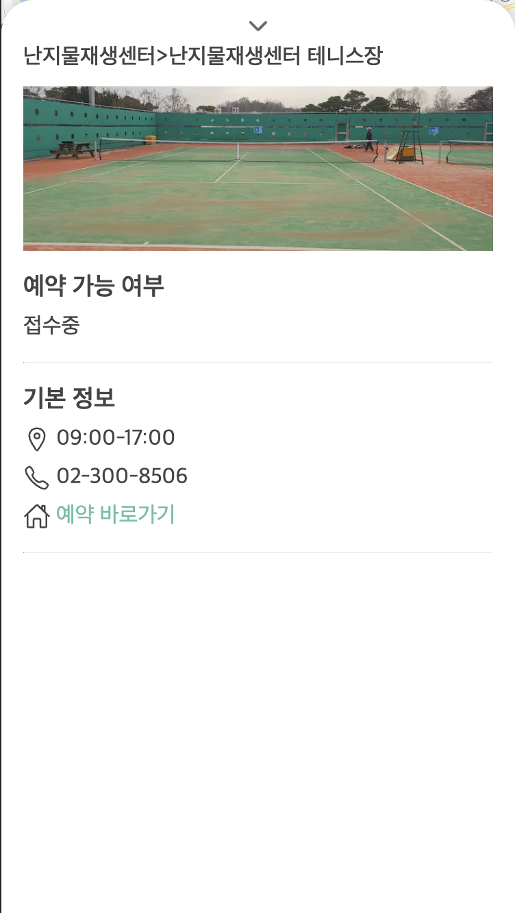

## 📱 UI [weShareTennis!](https://wesharetennis.vercel.app/)

<table cellpadding="0">
  <tr style="padding: 0; border: 'none';">
    <td valign="top"></td>
    <td valign="top"></td>
  </tr>
</table>

## 🛠️ Tech Stack

- [x] Framework `Next.js`
- [x] Language `Typescript`
- [x] Style `SCSS`
- [x] Formatter `ESLint, Prettier`
- [x] State Management `SWR`
- [x] Performance Check `Lighthouse`
- [x] Deploy `Vercel`
- [x] VCS `git`

## 🎾 Description

```
Naver Map Api를 사용하였고 서울시 공공API를 활용해 테니스 코트 데이터를 불러오고있습니다.
현재는 공립 코트의 예약 가능, 불가능 여부만 확인이 가능하며
추후 사립 코트와 무인 볼머신 코트 데이터 추가, 카테고리별 확인 기능 그리고 유저들 간의 소통이 가능하도록 디벨롭 예정입니다.
```
